# Cacti and succulent diary

## General notes
- Extremely roughly, cacti are on the gradient between round shape (desert) and long hanging shape (woods). The more desert, the dryer, less nutrient and more mineral in soil, more sunlight and colder winter they need.
- Soil. The very basic soil for round cactus is: sand for aquarium (>1-2mm, thin sand is bad) 1:1 mix with cheap cactus soil (mostly, a mix of peat, soil and perlite). For the forest, epiphytic cacti reduce sand, mix in normal soil and tree bark or orchid substrate. Next plan is to get some clay powder, lavalit or similar porous material and start mixing own based on different sepcies needs, according to Haage book.
- Light. In summer round cacti should be outside on south side, and forest cacti on northern or in the shade. Newly bought cacti or after wintering should be first placed in shade to avoid sunburn.
- Water. Hard water is very bad indeed, the calc precipitate damages the roots, seals the soil and especially seedlings are completely stuck in it. It should be rainwater. If no rain, try either diluting hard tap water with distilled, or freezing partially in a bottle, removing the water that did not freeze and using the melted ice. Chemical reduction of hardness I tried but pH afterwards is not acceptable! Boiling and letting it stand does not help at all.
- Rooting. [Super rooting tip from Kakteenforum](https://www.kakteenforum.de/showthread.php?8532-Sicher-und-schnell-bewurzeln!-TIPP!!). This Vogelsand is easily found in dm, MacGeiz, and costs 60 cents.

## Links
- species guide with many pictures https://cactiguide.com/ 
- [pictures of NL cacti](https://www.cactuskiev.com.ua/gallery/index.php/category/175-%D0%BA%D0%B0%D0%BA%D1%82%D1%83%D1%81%D1%8B)
- Залетаева - [Книга о кактусах](https://sheba.spb.ru/za/kniga-kaktus-1974.htm)
- [Uhlig Kakteen](www.uhlig-kakteen.de) have a lot of [care info](https://www.uhlig-kakteen.info/seite/158381/richtig_giessen_und_duengen.html), including diseases and cactus [calender](https://www.uhlig-kakteen.de/de/service/kakteenjahr/)

### September 2021

#### 4.: New cactus: Sulcorebutia rauschii

  
Again, tuberous root with smaller roots completely rotten. I chose the dryest one and the only one with a tiny offset. For now it is in sand and outside.

Plan for September: 
- no more adult plant purchases 
- one more watering, now that the days are relatively warm (up to 20 degrees with some sun)
- if it starts raining, move them to the balcony but keep outside in colder nights to harden them
- in October depending on weather, move inside

New substrate: lechuga pon. A compromise for the price, since it has pumice, lava and zeolith, I only need to dry it a bit and remove fertilizer balls.  
This will be my main mineral component from now on, will still add some 1-2mm sand for structure and some garden soil, proportions depend on the species.  
Before winter I will only pot the two tuberous root people into it, and they do need a lot of mineral.

### August 2021

#### 28.: new cacti arrivals

Source: 1.10 euro shop.  

Yes, I told myself to stop bying NL cacti but:
- Death rate is currently highest among Haage cacti, actually
- Looks like I even can determine at least genus for some (and those I take)
- If they survive I have a good feeling I could give them a better life

1. Espostoa sp.

Quick and dirty cleaned roots (I use old toothbrush) and put into the standard mix (1/3 sand 1-2mm, 1/3 standard plant soil, 1/3 cactus soil, take out larger wood/bark pieces, top and bottom 6-8mm stones). Since we do not have a lot of sun and it is well protected, put it on the south window right away, a little behind bigger pots.  
Note: sources say this species will not reach flowering maturity in pot.

2. Coryphantha sp. (potosiana?)

The poor plant lost all the smaller roots (next time look at the top of the soil, it had grey-blueish color). My first cactus with tuberous root! For now it goes for 1 week into Vogelsand, and away from sunlight, after that I have to think of a good soil mix. Haage says it should have clay which I still could not get my hands on.  

Note: now I have looked at both genus' species, I am quite convinced that two of the cacti I have got form the same source before also belong to those. A columnar one looks like [Espostoa calva](https://cactiguide.com/cactus/?genus=Espostoa&species=calva) (another name [Thrixanthocereus jelenkyanus](http://tonthat.50webs.com/Gia%20dinh/Columnar-cacti/index-55.html)). And the one with tubercles which I was not sure if it was a Mammillaria, might be [Coryphantha](https://cactiguide.com/cactus/?genus=Coryphantha), looks similar to georgii or maiz-tablasensis. It has two features that fit, tuberous root and grooves on the tubercles.

Note: add [Cipocereus](https://cactiguide.com/cactus/?genus=Cipocereus) to the wishlist, it has blue berries! 

#### 21.: new arrivals from Baumarkt toom

Baumarkt actually started to put some names on cacti, which moved me to try them out. I have to say however, the state of cacti in the baumarkt was much worse than in Lidl or in 1.10 euro shop (probably because they sit there for a while, whereas at a supermarket the turnover is quite fast, another advantage of buying there). But the choice of species is better, so one has to find a way to find out when new plants arrive and only buy them fresh. Best ist probably to check their [online page](https://toom.de/c/garten-freizeit/pflanzen-blumen/zimmerpflanzen/kakteen-tillandsien-bonsai) regularly. Also one has to watch for the names are not always correct, an obvious Gymnocalicium was labeled as Lithops.

1. Melocactus azureus
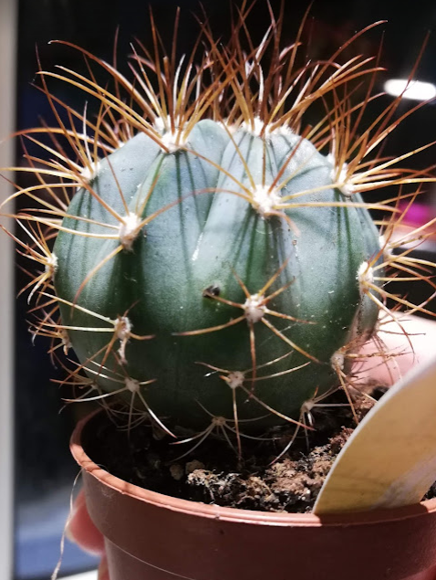
They looked horrible, many of them were black, I tried to choose a clean one but still found one black spot at home...  
People say they are when young not so difficult to cultivate. After they arrive at blooming age at 6-10 years, no repotting and no change of place is allowed. It was an opportunity to get one and save 1-2 years compared to seeds. It also has to have a warm winter, but still cool enough if there is not enough light. And it can even be watered a little.  Repotted into standard, a bit more nutritious mix (1/3 sand-1/3 cactus soil-1/3 normal soil), since they should like more nutrient. I keep it inside for the night.

2. Gymnocalicium michanovichii chlorophyllless (grafted on Hylocereus undatus)
Just because I wanted one. I took the largest one and with less fungi in the soil but now I think I should have taken the one with offsets. It had flower buds but most of them fell off already so nothing to expect here. I just hope for survival. Weirdly, the rootstock needs quite warm and wet winter, and the scion kind of standard cactus dry and cool. So one has to keep it in between to satisfy both, and colder to get flowers. We will see how long it lives at all. Right now the nights are below 15C and I keep it inside. Repotted into same mix as above, for the sake of Hylocereus.

3. A small crassula Buddha's temple. Neat, removing soil from the roots was super easy, just shake them a bit. Potted into a mix of normal soil and sand.

#### 16.: repotting the seedlings

I noticed they stopped growing and many were in calc. At the same time I change pots to smaller ones and reduced distance between the seedlings. I made a seedling tweezer out of eraser as recommended in the Zaletaeva book - works wonders!
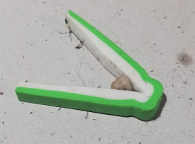
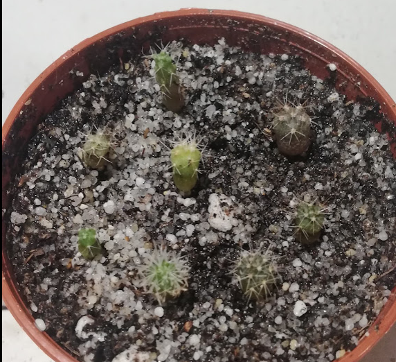
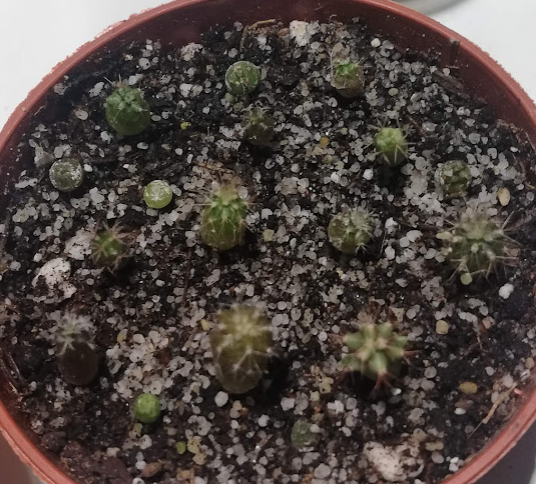

#### 14.: I am just so happy how spiny my Ferocactus has become!
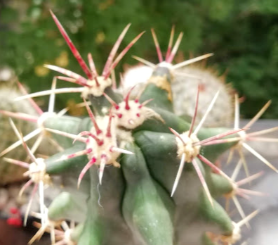
This one is a survivor from the times I had no idea about cacti and killed so many by overwatering. It is its first summer with direct sunlight and its spikes have changed to much thicker, redder, stripier, and hookier than before. I still think it might be stainesii.

#### 10.: Rebutia dead

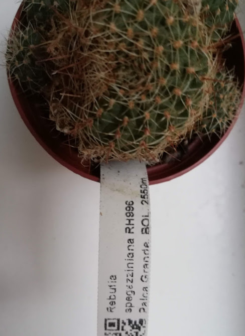
This was the third arrival from Haage. After cleaning flower leftovers I found  dark spots which grew and quickly consumed the whole cactus. I tried to remove as much seeds as I could, and seed pods were black too, so need to watch out for fungus when I seed them. I cut off 5 offsets, and stuck them in Vogelsand. (1 had to go because it was consumed with the same fungus).  
I am astonished how fast it went, and I would like to know the reason. Can fungus go in with the old flower leftovers? Big name nursery is definitely not a guarantee for a disease-free cactus! 

#### 4.: new growth on Gymnocalicium
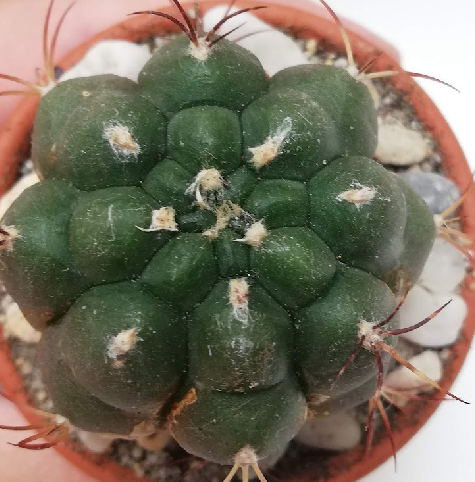
This is the second, and last, survivor from previous times. I separated it this spring, this is the biggest of the 3. Could not decide for north or south, at first it was reddened by the sun quite a bit. Now it is south but behind big pots.

#### 1.: Hylocereus is sick
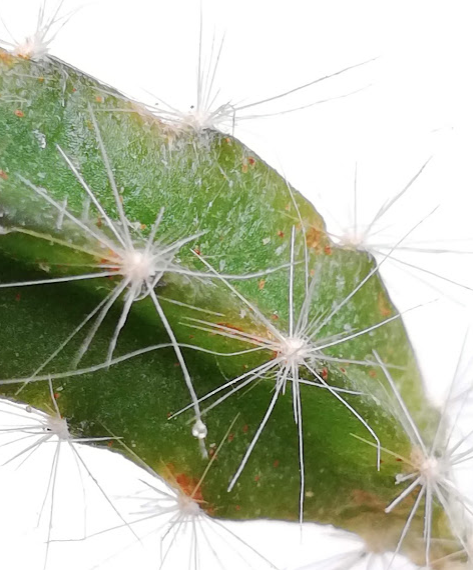
Stolen from Tahiti mix, it survived trips last winter, and now this, fungus? Lost a couple of twigs.

### July 2021

#### 31.: new arrivals from Haage in bloom

1. Astrophytum capricorne
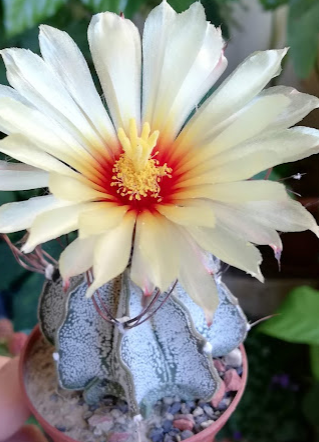

2. Aylostera muscula
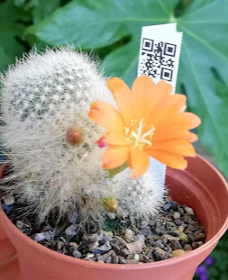

#### 28.: Lithops are dividing!
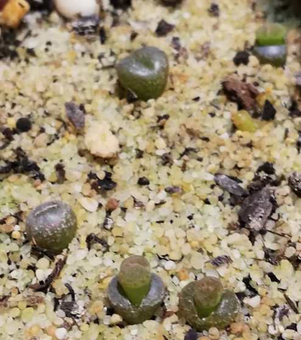
I came back after 1 week and saw 3/5 dividing. I watered them before leaving.

#### 20.: new arrival: Mammillaria bombycina
Source: Lidl  
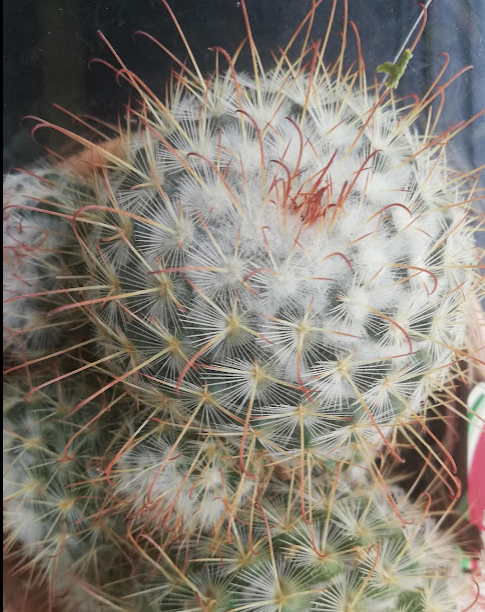  
There were two in the pot and gosh did it take me many evenings before I could separate them! Smaller ones are much easier.

### June 2021

#### 29.: new arrivals

source: 1 euro shop

1. Echinopsis subdenudata
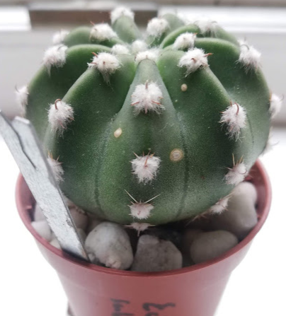

2. Mammillaria sp.
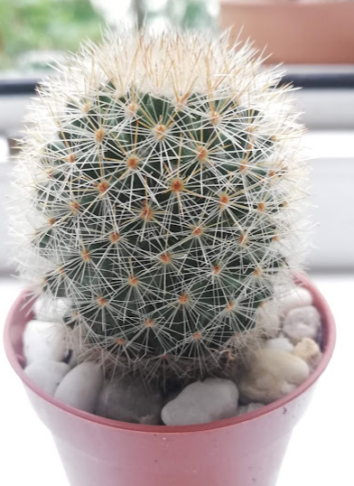

3. ?...cereus ?
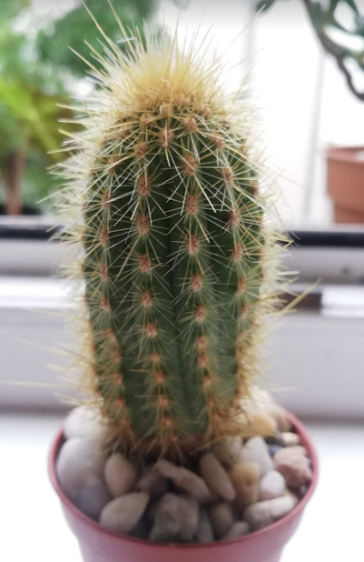

4. ??? Mammillaria or.. ? markiana?..
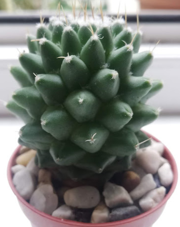

### April 2021

#### 20.: seeded Hylocereus undatus from fruit

Also the rest of the cactus mix seeds.

Shortly before: first cactus seedling
I thought it was a sand particle, but then saw it has roots :sweat_smile:
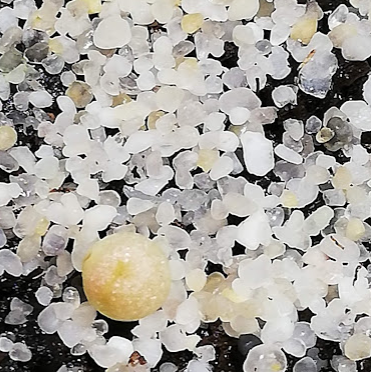

#### 13.: first Lithops!

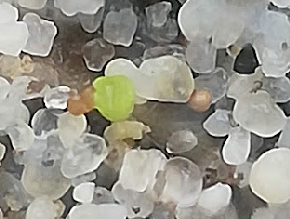

#### 7.: seeded cactus mix and lithops mix from ebay
Into mix of sand and cactus soil. Follow Haage: wet the soil properly by dipping, flatten the surface, distribute seeds, pour a 1-2mm layer of sand over it, cover with foil.

#### 6.:
Separated Gymnocalicium. 
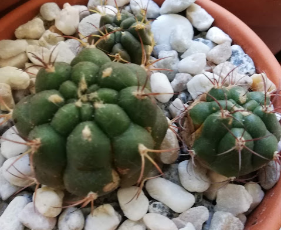

Before: repotted Ferocactus and other succulents (Crassula Hobbit, dying from overwatering Aloe) into proper soil (with sand).
