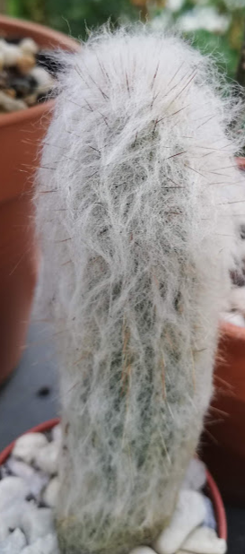
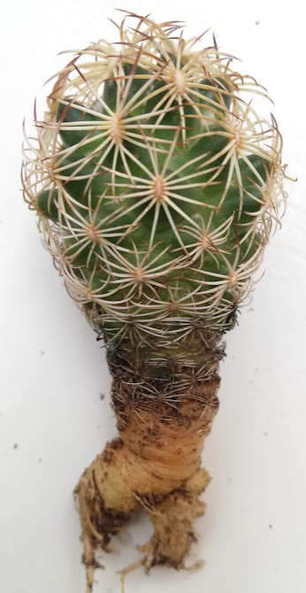

# Cacti and succulent diary

## Links
- guide with many pictures https://cactiguide.com/ 
- [pictures of NL cacti](https://www.cactuskiev.com.ua/gallery/index.php/category/175-%D0%BA%D0%B0%D0%BA%D1%82%D1%83%D1%81%D1%8B)

### August 2021

#### 28.: new cacti arrivals

Source: 1.10 euro shop.

1. Espostoa sp.  
  
Quick and dirty cleaned roots (I use old toothbrush) and put into the standard mix (1/3 sand 1-2mm, 1/3 standard plant soil, 1/3 cactus soil, take out larger wood/bark pieces, top and bottom 6-8mm stones). Since we do not have a lot of sun and it is well protected, put it on the south window right away, a little behind bigger pots.  
Note: sources say this species will not reach flowering maturity in pot.

2. Coryphantha sp. (potosiana?)  
  
The poor plant lost all the smaller roots (next time look at the top of the soil, it had grey-blueish color). My first cactus with tuberous root! For now it goes for 1 week into Vogelsand ([super rooting tip from Kakteenforum](https://www.kakteenforum.de/showthread.php?8532-Sicher-und-schnell-bewurzeln!-TIPP!!)), and away from sunlight, after that I have to think of a good soil mix. Haage says it should have clay which I still could not get my hands on.  

Note: now I have looked at both genus' species, I am quite convinced that two of the cacti I have got form the same source before also belong to those. A columnar one looks like [Espostoa calva](https://cactiguide.com/cactus/?genus=Espostoa&species=calva) (another name [Thrixanthocereus jelenkyanus](http://tonthat.50webs.com/Gia%20dinh/Columnar-cacti/index-55.html)). And the one with tubercles which I was not sure if it was a Mammillaria, might be [Coryphantha](https://cactiguide.com/cactus/?genus=Coryphantha), looks similar to georgii or maiz-tablasensis. One feature that it also has are grooves on the tubercles.

Note: add [Cipocereus](https://cactiguide.com/cactus/?genus=Cipocereus) to the wishlist, it has blue berries! 

### 
