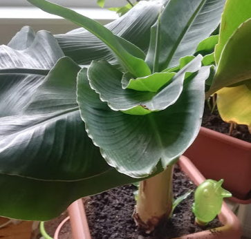
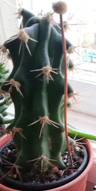
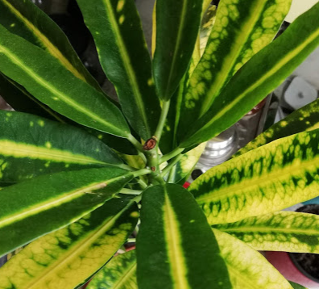
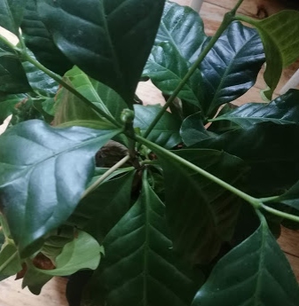
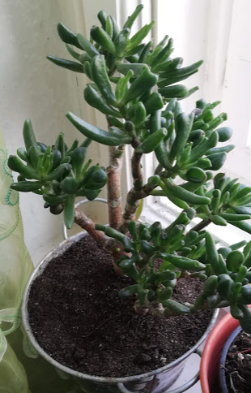
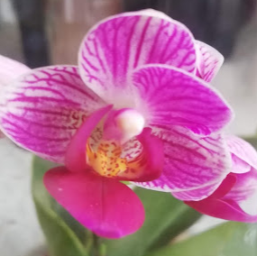
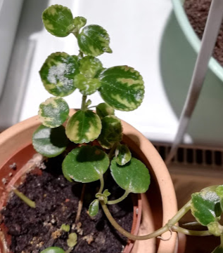
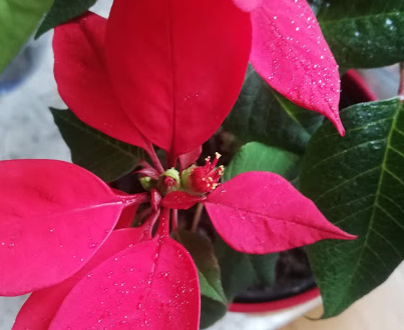
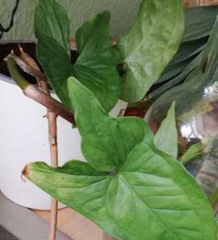
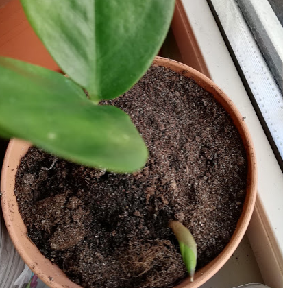

# Plant care

| Plant | Description | Location | Repot |
| --- | --- | --- | --- |
| Amaryllis  | South Africa (forest) [de](https://www.mein-schoener-garten.de/gartenpraxis/indoor/amaryllis-verblueht-was-tun-34631) In summer should be outside (no direct sunlight) and will go into dormancy in August. Don't use very big pot, if it has many small bulbs it will not bloom. For dormancy 2-3mo. should be dark and cool (10-15 degrees - I guess balcony would still work hm). November take it inside and start watering, lots of light needed. Important : water only from below, better too dry than too wet! Think dry and rain season in Africa.| Winter: inside south, Summer: outside north | :+1: Spring | 
|Alocasia|South-East Asia. It needs a lot of warmth and watering but the soil should be like for orchids so that water can come through. And it needs warm distilled water. (Mine has lost all leaves so trying to rescue it by replacing into such soil, putting the bag around and waiting till it is warm...) Think tropical rainforest. No direct sunlight too. And roots can rot really easily too. | Inside south | Spring :+1:|
| Ananas | how-to : I failed to root tops, many times, they all rot, in water and in soil, even if roots are already visible( If try again do it in summer so that fruits are not too cold. Have seeds, try to get them into over 30 degrees and highly humid and after 1mo. they might sprout. | | | 
| Anthurium  | Central and South America. Soil for aroid plants. Needs spraying. Medium light. Warm. Small pot stimulates flowering. [ru](https://rastenievod.com/anturium.html). Trips. | Inside south, away from window | Spring :+1: | 
| Banana  | SE Asia, India. [ru](https://flowertimes.ru/banan/) Lots of light and direct sunlight. High humidity and high water consumption. Warmth. Grows like crazy! Younglings dry easily and eaten by trips. Adult leaves they cannot pierce likely, so clean. | South inside | Spring | 
| Bergpalme (Chamaedorea elegans) | Mexico. [de](https://www.mein-schoener-garten.de/pflanzen/bergpalmen/bergpalme) Shade. Soil with sand. Cannot dry out! But water should drain easily. Does not need fertilizer 1 year after repotting. Spray in summer essential. Spinnmilbe, Blattläuse. | Spring :+1: | North inside | 
| Cactii  | America. Important: there are different requirements for forest cactii (long or flat) and desert cactii (round). Cool video see in [глазами ботаника](https://www.youtube.com/watch?v=entA2Ocfep4&list=PLdgctHOvALRt2kD-Lv37JoF7KJ1mA3eiA&index=4) channel about evolution of cactii and secondary aquisition of the leaf-like shape. Direct sunlight is only fine for those covered in white "hair". South location for round, north and no light and more water for long and even more for flat (like schlumbergera=Weihnachtscactus=декабрист). This one lives perfectly on northern window without additional light, and bedroom is heated less often so it is cool enough for it to blossom. Round ones should be on southern window or outside in summer, and ideally dormant at non heated room (bedroom is for them too warm), no water in winter, and more in summer (just make really sure the soil dries in between, I killed so many by overwatering). Apparently if you just by one of those 1€ cactus in Hollad shop it is quite impossible to say which species it is! Could ask in forum or try to compare pictures in this [catalog](http://cactus.from.by/article/opredelitel-gollandskih-kaktusov). I suspect one of mine is Gymnocalycium zegarrae. The long one is even less sure, Echinocactus platyacanthus? Also similar to Ferocactus stainesii but central spike has no hook.. 
| Chilli | Light. Insect magnet especially in winter when brought inside. Aphids and trips. Older plants give more but I often lose them in winter... | Summer outside north, Winter inside south | Spring | 
| Chlorophytum | America, S. Africa, subtropical near rivers. Likes spraying and moist (not too much though). Aerial light substrate is important! And fertilizer. Mine died for unknown reason (leaves started to rot from the root, decresing moisture did not help) | North inside | Spring | 
| Codiaeum (кротон)  | Pacific islands. Молочай. Яд! Если опадают листья, нужно пересадить, много удобрений, высокая влажность. Прищипать верхушку. Обязательно поливать тёплой водой, не допускать пересызание. Много рассеянного света, летом можно на улицу. Spinnmilbe. | South inside | :+1: Spring  |
| Coffee arabica Nana  | Winter high light, summer no direct sunlight, over 16C outside (in nature it is under trees so north balcony was good). Spraying good (not when in bloom). Soil acidic and light. Fertilizer. Cutting is stressful, but old tree could be cut on top and rooted again.  Needs deep pot because of the central root. Seeds should be planted right away if wanted. It actually should be 1 plant per pot. [ru](https://www.vogorodah.ru/vyrashhivanie-kofe-doma/) | Winter: South inside, Summer: North outside | :+1: Spring |
| Crassula ovata (hobbit) | [ru](https://kaktus-sukkulent.ru/sukkulenti/vidi-sukkulentov/krassula-khobbit-i-gollum/) No panic if young plant starts to lose green leaves: it is getting a bonsai look :) Sunny, needs southern window. Water ~2w summer, less winter. Winter dormancy best at ~10-15C. | | as needed|
| Crocus | Saffran family. Needs sandy high pH soil and sunny place (mine rotted in March showers). |  
| Dracaena lucky bamboo | Cameroon . No direct sunlight, high humidity. High temperature. Trips can eat leaves. I rooted a sprout but it is not very spectacular. Original plant is in water with a drop of fertilizer and is neither dying nor growing. | North inside | Change water |
| Dracaena | No direct sunlight, warm. Spraying fine. Water only when dry. | North inside | | 
| Fatsia | Japan. [ru](https://rastenievod.com/fatsiya.html) Much light, not direct sunlight, should not dry out, lots of fertilizer. Trips can eat it. | North inside (using lamp) in winter, outside summer | | 
| Ficus elastica (Gummibaum) | India, Java. Half shade OK. No direct sunlight. Not under 15C. Water only after dry. Spraying. Trips can eat leaves. | North inside | | 
| Lichi ( seeds ) | will sprout in warm condition but die later. | | | 
| Mango (seeds) | will sprout in warm condition but die later. |||
| Monstera | Central America forest. No direct sunlight but does need quite some light. Needs big support. Careful with aerial roots. Needs spraying. Winter south side OK, summer move it to the back. Trips. Well draining soil. | Winter south inside window, summer south away from the window | :+1: Spring | 
| Peperomia orba | Better drier than too wet! No direct sunlight but a lot of light. Needs regular cutting, cuttings root very easily in water. [ru](https://rastenievod.com/peperomiya.html) my source: Lidl | North inside | Renew the plant regulary |
| Phalaenopsis  | [ru](https://orchidsworld.com.ua/blog/uhod/ukhod-za-orkhideyey-v-raznyye-pory-goda) why roots rot: less light (Fall) so less evaporation so no water movement! https://orchidsworld.com.ua/blog/problems-with-the-roots/gniyut-korniMuch less water in winter, never direct sunlight but at least 10-12h light day, fertilize in spring, possible to be outside in summer (night >15C) but watch out for pests! if there are small insects means too wet and rotten parts inside. However not all what is black is dead! with mine it is firm and green inside often so still alive | North inside (with lamp!) | Check roots regularly for rotting | 
| Philodendron | I grow it in aquaculture and it works, just water with 10x less fertilizer. Once got root rot, probably overdid fertilizer, need to give it periods of water only. Can be eaten by trips. Super easy rooting cuttings. If you do not cut the tips off will grow long. Check roots regularly. Rotten roots are black and soft, healthy roots white and firm. | North inside lamp, south inside away from the window | When needed |
| Pilea depressa  | Caribbean. [de](https://pflanzio.de/pilea-depressa/) [ru](https://floral-city.ru/pilea-pileya.html) No direct sunlight! Bright shade. Watering normal, not too wet. Drainable soil. Not under 15C. Roots super easily (1 node is enough). Probably needs renewing. If losing leaves probably too cold+too wet or too dark. Trips. | South inside shade | |
| Poincettia Xmas star  | Mexico. [ru](http://myflo.ru/catalog/puansetija/rozhdestvenskij_cvetok_puansetija_uhod_v_domashnih_uslovijah) Needs water but not too wet! Either over drying or over wetting kills it. Needs regular cutting. Cuttings are hard to root (never worked for me). After blooming needs 2 mo. of rest (14 degrees, less water). To have it bloom by Xmas just keep it at natural light day in Northern window after bringing it inside in fall. For me bedroom worked since we hardly use artificial light in the evening there. Soil needs to be well drained and slightly acidic. | :+1: Spring (after bloom) | South inside. | 
|Schlumbergera|Soil mix normal with succulent. Never direct sunlight, forest cactus. Needs 15C dormancy to flower. DO NOT MOVE especially when in bloom since it will throw flowers off. |North inside| Spring|
| Singonium  | Easy to root, no direct sunlight. Can grow in aquaculture. Trips. source: cutting | north inside, south away from the window | as needed | 
| Spathiphyllum | Brasil, Philippines. Not under +10! (winter take it to the living room), lots of light, south side! High humidity. Too large pot will stimulate sprouts and less flowers. | South inside (bathroom) | :+1: Spring, When necessary |
|Zamioculcas  | Africa. Lot of light, can tolerate direct sunlight (other sources say not, leaves will get yellow and fall off). Watering only after dry!! (every 2 w summer, 4w winter) Some fertilizer but not much, spraying in summer is OK. [ru](https://rastenievod.com/zamiokulkas.html) It grows really slowly (use pot only a bit bigger than the plant)! I started from young leaf that broke off, it took it 1 year to make a tuber, then the leaf was gone and after another year it made the first new leaf with 2 leaflets only. Be patient :-) | South inside | Spring/Summer/Only when necessary |
|||||

